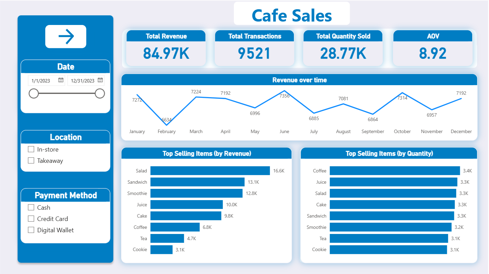
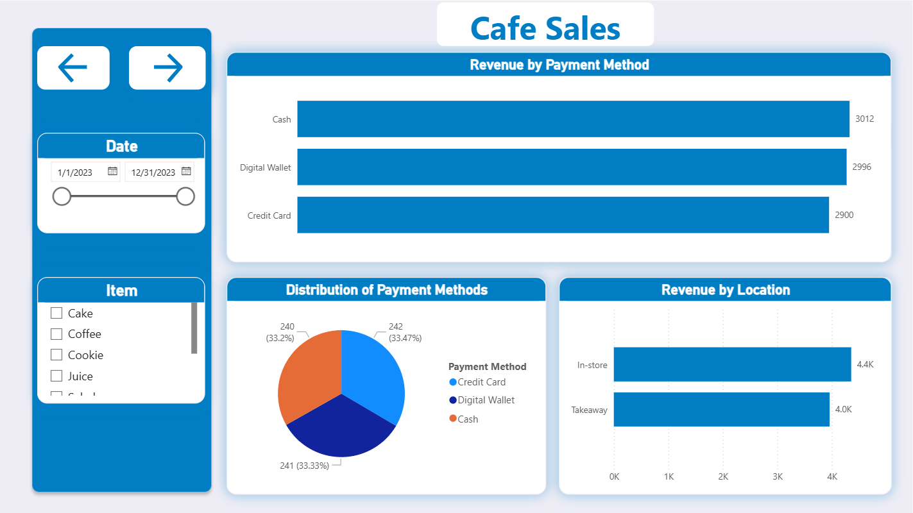
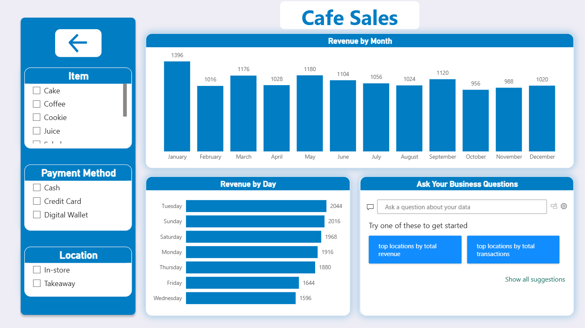

## Project Overview

This project analyzes cafe sales data to uncover key insights related to product performance, customer behavior, trends, and payment preferences.  
The goal is to support data-driven decision-making by transforming raw transactional data into actionable business insights using Power BI.

---

## Tools & Technologies

- Power BI  
- Power Query (Data Cleaning & Transformation)  
- DAX (Measures & KPIs)  
- Excel / CSV Dataset  

---

## Data Cleaning Process

The dataset was cleaned and prepared using Power Query, including:

- Handling missing and inconsistent values  
- Standardizing categorical fields (Item, Location, Payment Method)  
- Converting data types (especially Transaction Date)  
- Reconstructing missing numerical values using logical calculations  
- Fixing invalid entries (errors and blanks)

---

## Key Performance Indicators (KPIs)

- **Total Revenue** = Sum of Total Spent  
- **Total Transactions** = Count of Transaction ID  
- **Total Quantity Sold** = Sum of Quantity  
- **Average Order Value (AOV)** = Total Revenue / Total Transactions

- ---

## Dashboard

---

## Key Insights

- Salad is the highest-selling product, while Cookie is the lowest-performing product in terms of sales volume  
- Coffee records the highest sales volume in terms of quantity, while Cookie remains the lowest-performing product  
- June represents the highest-performing month in terms of total sales  
- Thursday and Friday are the highest-performing days in terms of sales activity  

---

## Recommendations

- We might increase the product price slightly, but it won't make a big difference to the customer  
- Implement a strategic bundling approach by pairing Coffee with Cookie at a discounted price. Since Coffee is a highly preferred product with strong demand, bundling it with Cookie can help increase the sales of the underperforming 
product while offering perceived value to customers through discounts  
- We should plan for something like this this year by focusing on increasing our marketing campaigns before this month, advertising our offers, and increasing our stock  
- This is because of the weekend, so we can take advantage of this by creating offers that are only for the weekend
